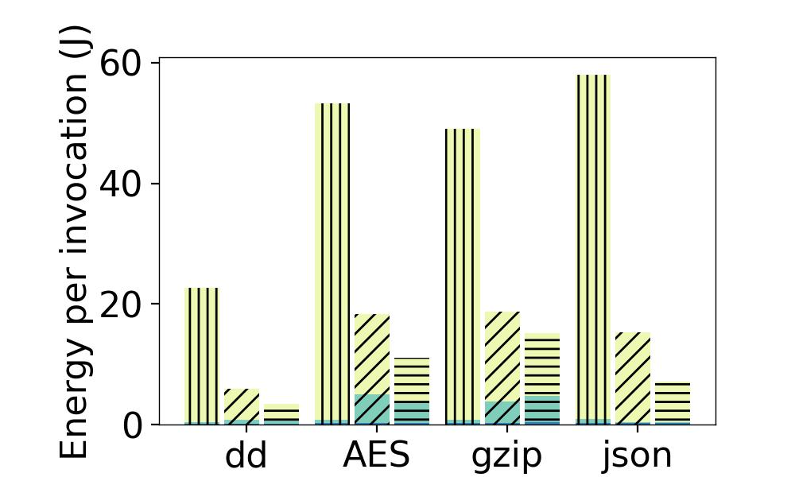
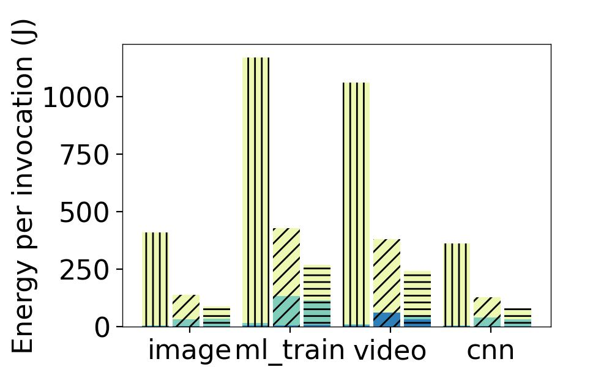
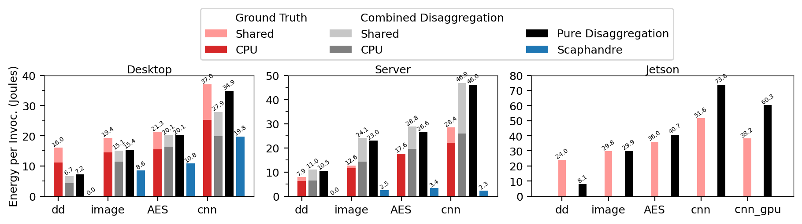
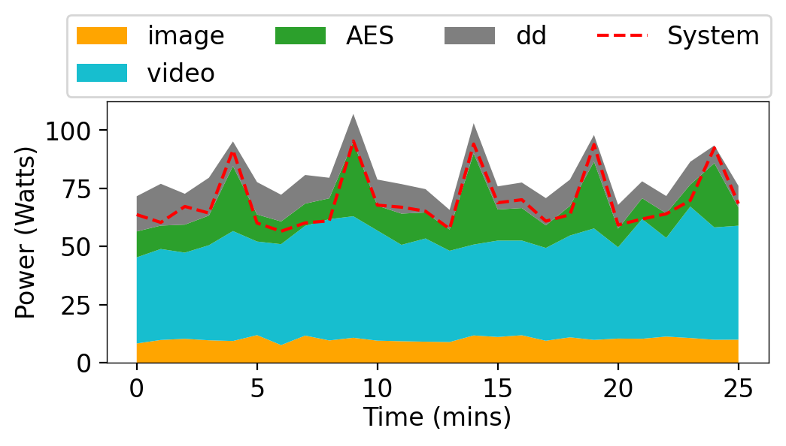
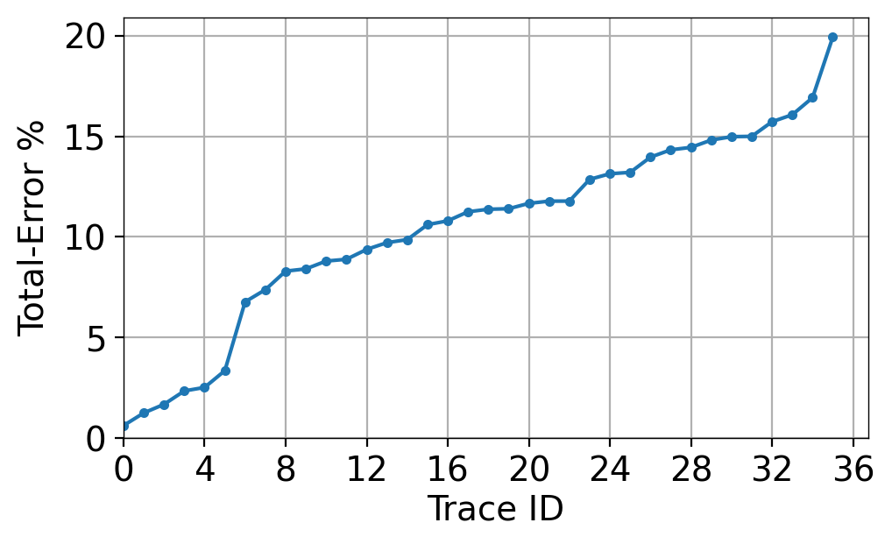
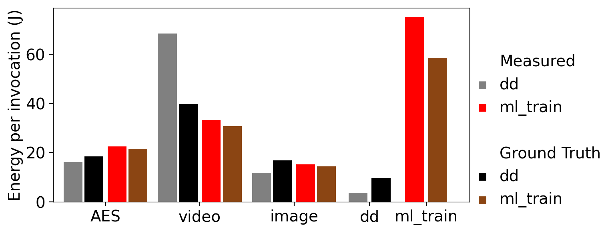
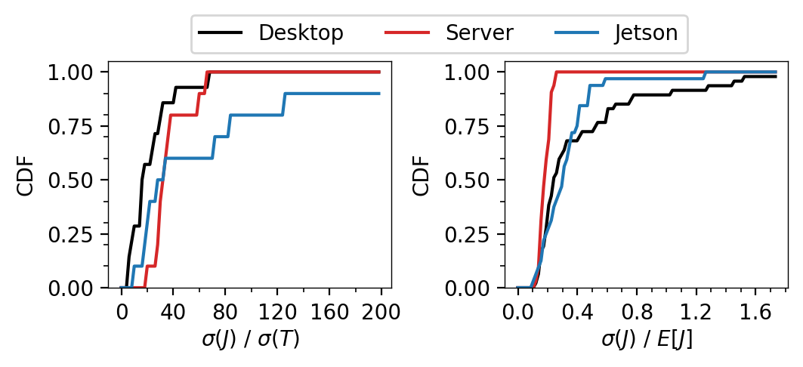

# Accountable Carbon Footprints and Energy Profiling For Serverless Functions

Artifacts and results for the paper [Accountable Carbon Footprints and Energy Profiling For Serverless Functions](todo)

## Serverless Control Plane

These were captured and generated using the [Ilúvatar](https://github.com/COS-IN/iluvatar-faas) serverless control plane.
The main driver which captures energy and performance details are collected is in [this set of files](https://github.com/COS-IN/iluvatar-faas/tree/master/src/Il%C3%BAvatar/iluvatar_library/src/energy).
For example it can pull data from [Intel and AMD RAPL registers](https://github.com/COS-IN/iluvatar-faas/blob/master/src/Il%C3%BAvatar/iluvatar_library/src/energy/rapl.rs) and query [baseboard management controller IPMI data](https://github.com/COS-IN/iluvatar-faas/blob/master/src/Il%C3%BAvatar/iluvatar_library/src/energy/ipmi.rs).
These metrics are collected and fed into the [FaasMeter system](./faasmeter/) to determine per-function and per-invocation energy usage and carbon fotprints.
Our control plane also possesses the capability to [limit dispatches of enqueued invocations](https://github.com/COS-IN/iluvatar-faas/blob/master/src/Il%C3%BAvatar/iluvatar_worker_library/src/services/invocation/energy_limiter.rs) if the energy consumption of the hardware is too high.


## Prerequisites

To run the analysis and graphing scripts, the following dependencies are needed.

```sh
sudo apt install python3 python3-pip
```

Then run this script which will generate all the plots.
```sh
./plot_all.sh
```

## Generated Figures

These are all the plots from the paper that are generated by the artifacts and scripts in this repository.
Traces can be found in the output-full-mc_a.json file in the corresponding linked directories. 

Figure 2





Figure 6


Figure 8



Figure 10a


Figure 10b


Figure 10c



Figure 11


Figure 12

